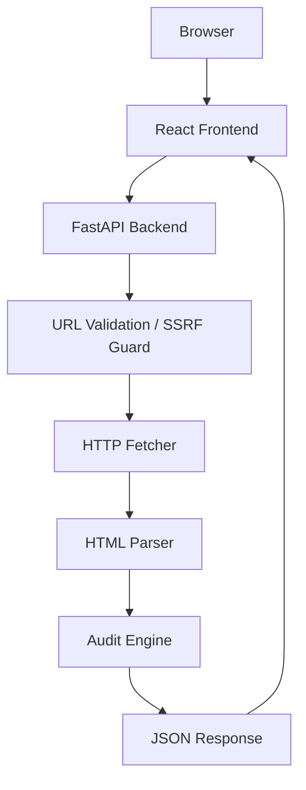
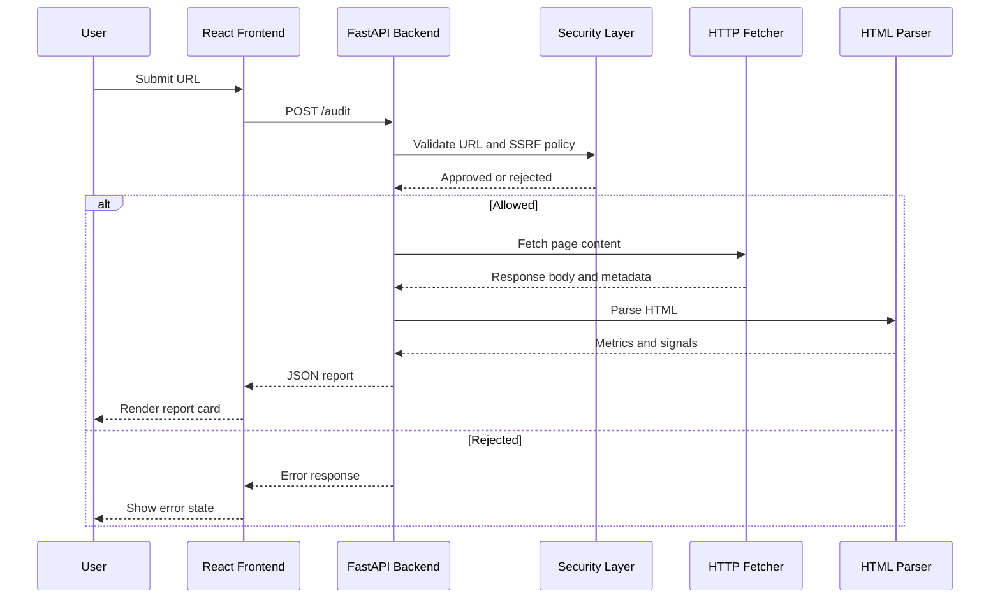

# Page Pulse

## Digital Heroes Software Development Assessment

**Project Name:** Page Pulse \
**Author:** Khilesh Chaudhari \
**Submission Date:** 2026-07-25 \
**Version:** 1.0.0 \
**Technology Stack:** React, TypeScript, Vite, FastAPI, Python, BeautifulSoup, httpx, Pydantic, pytest, Vercel, Render \
**Repository Link:** https://github.com/Khilesh-01/Digital_Heros_Tasks \
**Live Application Link:** https://digital-heros-tasks.vercel.app/

---

## Table of Contents

1. [Executive Summary](#1-executive-summary)
2. [Problem Statement](#2-problem-statement)
3. [Project Objectives](#3-project-objectives)
4. [Functional Requirements](#4-functional-requirements)
5. [Non-Functional Requirements](#5-non-functional-requirements)
6. [Technology Stack](#6-technology-stack)
7. [System Architecture](#7-system-architecture)
8. [Application Workflow](#8-application-workflow)
9. [Backend Design](#9-backend-design)
10. [Frontend Design](#10-frontend-design)
11. [API Documentation](#11-api-documentation)
12. [Security Considerations](#12-security-considerations)
13. [Testing Strategy](#13-testing-strategy)
14. [Deployment](#14-deployment)
15. [Challenges and Solutions](#15-challenges-and-solutions)
16. [Performance Considerations](#16-performance-considerations)
17. [Future Enhancements](#17-future-enhancements)
18. [Conclusion](#18-conclusion)
19. [Appendix](#19-appendix)

---

## 1. Executive Summary

Page Pulse is a full-stack web application designed to audit public web pages and return a concise report on HTTP health, response time, and basic on-page SEO and structural signals. The product is intentionally lightweight: a user submits a public URL, the backend fetches the content, parses the HTML, and returns a structured JSON report to the frontend for presentation.

The project was developed to address a common engineering workflow gap: developers and QA engineers frequently need quick visibility into whether a webpage is reachable, whether it has foundational SEO metadata, and whether its structure is accessible enough to be considered reasonably complete. Instead of relying on multiple manual checks or external tools, Page Pulse consolidates these signals into a single workflow.

From an engineering perspective, the system demonstrates an end-to-end solution built with clear separation of concerns. The backend uses FastAPI and Python services to validate input, enforce SSRF protection, fetch and stream HTML safely, and parse content with BeautifulSoup. The frontend uses React and TypeScript to provide a responsive UI with loading, error, and success states. The implementation also includes automated tests covering parsing, security, and API behavior. The project successfully demonstrates a production-oriented architecture suitable for further extension.

---

## 2. Problem Statement

Modern web development requires rapid diagnosis of basic page quality factors. When a page is deployed or updated, engineers need to answer several practical questions quickly:

- Is the page reachable over HTTP or HTTPS?
- Does it respond within an acceptable time?
- Does it expose meaningful SEO metadata such as a title and meta description?
- Are images missing alternative text?
- Is the page structure semantically reasonable for a crawler or human reviewer?

These metrics are valuable because they correlate directly with web performance, discoverability, accessibility, and developer productivity. A broken or slow page can harm user experience; missing metadata can reduce search visibility; and missing alt text can degrade accessibility. For developers, the ability to gather these signals quickly reduces debugging effort and shortens feedback loops during iteration.

Page Pulse addresses this need by automating the audit process and presenting the result in a structured, easy-to-consume format.

---

## 3. Project Objectives

The project objectives were defined around both functional utility and engineering quality.

### Functional Objectives

- Allow a user to submit a public URL for analysis.
- Measure the HTTP response status and response time.
- Extract key SEO-related metadata from the HTML.
- Count structural indicators, including H1 tags and image alt-text issues.
- Estimate visible word count from the rendered page content.
- Return a clear report through a web interface and API.

### Non-Functional Objectives

- Performance: return results promptly and avoid excessive latency.
- Reliability: handle network and parsing failures gracefully.
- Security: prevent unsafe URL targets and protect the service from SSRF-style misuse.
- Maintainability: keep business logic isolated in clearly defined services.
- Usability: provide simple interactions with explicit loading and error states.
- Scalability: support future extension without major architectural rewrites.

---

## 4. Functional Requirements

The application implements a practical set of functional capabilities that align with the assignment brief and the current codebase.

| Feature                     | Implementation                                                | Notes                                              |
| --------------------------- | ------------------------------------------------------------- | -------------------------------------------------- |
| Audit URL                   | Frontend form posts to the backend endpoint at /audit         | Validates URL format in the UI and server          |
| Measure response time       | The fetcher records elapsed time per request                  | Returned in the report as response_time_ms         |
| Extract title               | Parsed from the HTML tag                                      | Stored as title                                    |
| Extract meta description    | Parsed from the page meta description tag                     | Stored as meta_description                         |
| Count H1 tags               | Determined from the HTML structure                            | Stored as h1_count                                 |
| Count images missing alt    | Parsed from all img tags                                      | Stored as images_without_alt                       |
| Estimate visible word count | Visible text is extracted and tokenized                       | Excludes script/style content                      |
| Display report              | React report card renders summary and extended metrics        | Includes copy/download functionality               |
| Loading states              | The app shows a skeleton loader while an audit is in progress | Improves perceived responsiveness                  |
| Error handling              | API and UI both render user-safe error messages               | Prevents raw stack traces from reaching the client |
| API documentation           | FastAPI auto-generates OpenAPI documentation                  | Available at /docs and /redoc                      |

The major implemented features correspond directly to the core service modules in [backend/app/services/parser.py](backend/app/services/parser.py), [backend/app/services/fetcher.py](backend/app/services/fetcher.py), and [backend/app/services/auditor.py](backend/app/services/auditor.py).

---

## 5. Non-Functional Requirements

The non-functional requirements were treated as first-class concerns in the system design.

| Requirement Area | Design Approach                                                                |
| ---------------- | ------------------------------------------------------------------------------ |
| Performance      | Bounded request timeouts, response-size caps, and efficient HTML parsing       |
| Security         | Strict URL validation, SSRF checks, and content-type validation                |
| Maintainability  | Use of service-oriented backend modules and typed frontend contracts           |
| Availability     | Graceful handling of network and upstream failures with mapped error responses |
| Usability        | Simple form-based workflow with status states and actionable error messaging   |
| Accessibility    | Basic form labels, error roles, and semantic UI structure                      |
| Responsiveness   | Lightweight frontend with asynchronous request handling                        |
| Testing          | Automated unit and integration tests for parser, security, and API behavior    |
| Deployment       | A split deployment model across Vercel and Render for frontend and backend     |

These qualities were implemented through configuration-driven behavior rather than hard-coded assumptions. The project uses environment variables in [backend/app/core/config.py](backend/app/core/config.py) to tune network and security policies for different deployment environments.

---

## 6. Technology Stack

The technology choices reflect the need for a fast development cycle, clear API contracts, and a lightweight deployment model.

| Layer               | Technology        | Why It Was Chosen                                                         | Trade-Off                                                        |
| ------------------- | ----------------- | ------------------------------------------------------------------------- | ---------------------------------------------------------------- |
| Frontend            | React             | Fast component-based UI development                                       | Requires a build step and a client-side runtime                  |
| Frontend typing     | TypeScript        | Improves maintainability and catches contract issues earlier              | Slightly more verbose than JavaScript                            |
| Frontend build tool | Vite              | Fast local development and efficient production builds                    | Smaller ecosystem than older toolchains in some cases            |
| Backend             | FastAPI           | Simple API definitions, async support, and automatic OpenAPI generation   | Python-based service model may be less familiar to some teams    |
| HTML parsing        | BeautifulSoup     | Robust handling of imperfect markup and straightforward extraction logic  | It parses HTML rather than executing JavaScript                  |
| HTTP client         | httpx             | Modern async network client with controlled timeout and redirect behavior | Requires explicit exception handling and configuration           |
| Validation          | Pydantic          | Strong request/response validation and typed models                       | Requires understanding of schema-driven development              |
| Testing             | pytest            | Mature, widely adopted test framework with async support                  | Test setup must be explicit for network mocking                  |
| Hosting             | Vercel and Render | Easy deployment for frontend and backend with minimal configuration       | Platform-specific environment behavior must be managed carefully |

The stack is sufficient for the project scope while remaining open to future expansion into richer analytics or background processing.

---

## 7. System Architecture

The architecture follows a simple request-response pattern, with a clear separation between interface, analysis, and presentation layers.



### Component Responsibilities

- Browser: The client submits a URL and displays the returned report.
- React Frontend: Provides the user experience, state transitions, and error rendering.
- FastAPI Backend: Serves the REST endpoints and coordinates the auditing workflow.
- URL Validation / SSRF Guard: Ensures the target is a valid and safe public URL.
- HTTP Fetcher: Performs network fetches with timeout, redirect, and content-size controls.
- HTML Parser: Extracts title, description, heading, image, and word-count signals.
- Audit Engine: Aggregates the results into the final report payload.

This design is intentionally simple and modular. Each domain concern is isolated in a dedicated module, which makes the system easier to test and evolve.

---

## 8. Application Workflow

The application workflow begins with user submission and ends with a rendered report.



### Workflow Description

1. User submits a URL through the form in [frontend/src/components/AuditForm.tsx](frontend/src/components/AuditForm.tsx).
2. The frontend sends the payload to the backend endpoint defined in [backend/app/api/routes.py](backend/app/api/routes.py).
3. The backend validates the request and applies URL-level security checks through [backend/app/core/security.py](backend/app/core/security.py).
4. The fetcher retrieves the content and applies timeout and size constraints.
5. The parser extracts structural and SEO-relevant signals.
6. The auditor assembles the final report and returns it in JSON format.
7. The frontend renders either a success report, a loading placeholder, or an error alert.

The workflow is designed to fail safely. Network issues, unsupported content types, and malformed HTML are converted into explicit, user-safe error responses.

---

## 9. Backend Design

The backend is organized around a layered structure that separates API handling, validation, transport, parsing, and domain exceptions.

### Folder Structure

- [backend/app/main.py](backend/app/main.py): application entry point and middleware setup
- [backend/app/api/routes.py](backend/app/api/routes.py): API routing for /health and /audit
- [backend/app/api/error_handlers.py](backend/app/api/error_handlers.py): centralized error translation
- [backend/app/core/config.py](backend/app/core/config.py): environment-driven configuration
- [backend/app/core/security.py](backend/app/core/security.py): URL validation and SSRF guard
- [backend/app/core/exceptions.py](backend/app/core/exceptions.py): typed domain exceptions
- [backend/app/models/schemas.py](backend/app/models/schemas.py): Pydantic request and response models
- [backend/app/services/fetcher.py](backend/app/services/fetcher.py): HTTP retrieval with retry and timeout logic
- [backend/app/services/parser.py](backend/app/services/parser.py): HTML extraction and signal parsing
- [backend/app/services/auditor.py](backend/app/services/auditor.py): orchestration of the audit workflow

### Design Principles

- Separation of concerns: route handlers remain thin and delegate to service modules.
- Centralized error handling: all expected failures are normalized through a shared exception pipeline.
- Configurability: runtime behavior is controlled by environment variables.
- Type safety: Pydantic models define the contract between the API and consumers.

The backend architecture is deliberately simple, which keeps the system understandable while remaining robust enough for an assessment-grade implementation.

---

## 10. Frontend Design

The frontend is implemented as a single-page React application with a minimal but clear user experience.

### Component Hierarchy

- [frontend/src/App.tsx](frontend/src/App.tsx): owns high-level state transitions
- [frontend/src/components/AuditForm.tsx](frontend/src/components/AuditForm.tsx): input form and client-side URL validation
- [frontend/src/components/ReportCard.tsx](frontend/src/components/ReportCard.tsx): visual presentation of the audit result
- [frontend/src/components/SkeletonLoader.tsx](frontend/src/components/SkeletonLoader.tsx): loading experience
- [frontend/src/components/ErrorAlert.tsx](frontend/src/components/ErrorAlert.tsx): error rendering
- [frontend/src/components/EmptyState.tsx](frontend/src/components/EmptyState.tsx): initial or empty-state UI
- [frontend/src/components/Toast.tsx](frontend/src/components/Toast.tsx): feedback after copy action

### State Management

State is managed locally in the App component using React hooks. The UI transitions through four principal states: idle, loading, success, and error. This design is sufficient for the project scope and keeps the application straightforward.

### API Communication

The frontend communicates with the backend using Axios through [frontend/src/api/client.ts](frontend/src/api/client.ts). Errors are normalized into a uniform shape so the UI does not need to branch on multiple exception formats.

### UX Considerations

- The form disables repeated submission while a request is active.
- The app provides explicit feedback for invalid input and failed requests.
- The report card offers practical actions such as copy and download.
- The layout is responsive and adapted for the single-screen reporting workflow.

---

## 11. API Documentation

The application exposes a small but well-structured API surface.

| Endpoint | Method | Description                              | Request                              | Response                                   | Status Codes       |
| -------- | ------ | ---------------------------------------- | ------------------------------------ | ------------------------------------------ | ------------------ |
| /health  | GET    | Returns the service health status        | None                                 | `{ "status": "ok", "version": "1.0.0" }` | 200                |
| /audit   | POST   | Audits a public URL and returns a report | `{ "url": "https://example.com" }` | Report object with metrics and metadata    | 200, 422, 502, 504 |

### Example Request

```json
{
  "url": "https://example.com"
}
```

### Example Response

```json
{
  "url": "https://example.com/",
  "status": 200,
  "response_time_ms": 128,
  "title": "Example Domain",
  "meta_description": null,
  "h1_count": 1,
  "images_without_alt": 0,
  "word_count": 28,
  "total_images": 0,
  "canonical_url": null,
  "og_title": null,
  "favicon_present": false,
  "language": null,
  "content_size_bytes": 1256,
  "seo_score": 55
}
```

The API documentation is automatically exposed by FastAPI at /docs and /redoc, which improves maintainability and integration usability.

---

## 12. Security Considerations

Security was treated as a core requirement rather than an afterthought. The application implements several protective measures.

- Input validation: request bodies are validated using Pydantic models, including minimum length and maximum length constraints.
- URL validation: the backend checks that the URL includes an acceptable scheme and a valid host.
- SSRF protection: the service rejects localhost and private/reserved addresses before making outbound requests.
- Timeouts: both request timeout and connect timeout are enforced to avoid hanging requests.
- Content type validation: only HTML content is accepted for parsing.
- Error handling: user-facing errors are sanitized and never expose raw exception details.

These controls matter because the system fetches arbitrary public URLs. Without safeguards, the service could be misused to probe internal resources or be placed under denial-of-service conditions. The implementation addresses these concerns in [backend/app/core/security.py](backend/app/core/security.py) and [backend/app/services/fetcher.py](backend/app/services/fetcher.py).

---

## 13. Testing Strategy

The testing strategy emphasizes confidence in the core business logic without depending on external network behavior.

### Unit Testing

The parser was tested in isolation to verify correct extraction of structural signals and safe handling of malformed or empty HTML. These tests are implemented in [backend/tests/test_parser.py](backend/tests/test_parser.py).

### API Testing

The HTTP route behavior was tested through FastAPI integration-style tests. These tests mock the fetch layer and verify that the API returns correct responses and error envelopes. They are defined in [backend/tests/test_api.py](backend/tests/test_api.py).

### Security Testing

Security behavior was validated around URL formatting and SSRF-protection logic in [backend/tests/test_security.py](backend/tests/test_security.py).

### Testing Philosophy

The project follows a pragmatic testing philosophy: test the logic that matters most, keep tests deterministic, and avoid network dependency in automated runs. This is particularly important for a service that fetches external content, where real-world networking introduces instability.

---

## 14. Deployment

The solution is deployed using a split architecture suited to the project’s two primary concerns: frontend hosting and backend hosting.

### Frontend Deployment

The React application is deployed to Vercel using the configuration in [frontend/vercel.json](frontend/vercel.json). Vite builds the application and serves the optimized static bundle.

### Backend Deployment

The FastAPI backend is deployed to Render using the configuration in [render.yaml](render.yaml). The service is launched with Uvicorn and exposed through the platform’s web service runtime.

### Environment Variables

The backend reads configuration from environment variables through [backend/app/core/config.py](backend/app/core/config.py). These include timeout values, redirect limits, maximum response size, allowed schemes, and CORS origins.

### Production Considerations

The deployment model supports an independent scaling path for frontend and API concerns. It also allows environment-specific tuning without changing the application logic. In production, the service is expected to operate behind explicit CORS and SSRF protections, with network and timeout policies enforced centrally.

---

## 15. Challenges and Solutions

Several engineering challenges arose during implementation, and each was addressed in a way that preserved maintainability.

| Challenge                                        | Solution                                                                                             |
| ------------------------------------------------ | ---------------------------------------------------------------------------------------------------- |
| CORS configuration                               | The backend uses FastAPI middleware with explicit CORS origins configured from environment variables |
| Deployment mismatch between frontend and backend | Separate deployment targets were defined for the static frontend and the API service                 |
| HTML inconsistencies and malformed markup        | BeautifulSoup was used in a lenient parsing mode so the parser remains resilient                     |
| Network failures and timeouts                    | The fetcher translates network and timeout exceptions into explicit domain errors                    |
| Malformed or missing metadata                    | The parser uses safe defaults and returns null/empty values rather than raising errors               |
| Large or streaming responses                     | The fetcher reads content incrementally and caps the total size to protect memory usage              |

These challenges were solved with a combination of defensive programming, configuration-driven behavior, and isolated service boundaries.

---

## 16. Performance Considerations

The current implementation is optimized for simplicity and correctness rather than maximum throughput. However, key performance concerns were addressed directly.

- HTTP requests are bounded by configurable timeout values.
- The fetcher reads the response incrementally rather than buffering arbitrarily large bodies.
- HTML parsing is lightweight and uses a single-pass extraction strategy for the required signals.
- The system avoids unnecessary computation and returns a compact JSON payload.

A likely next improvement is response caching for repeated audits of the same URL. This would reduce repeated network cost and improve user experience for common targets.

---

## 17. Future Enhancements

The current implementation establishes a strong foundation for future growth. Potential enhancements include:

- SEO scoring with a more comprehensive heuristic model
- Scheduled or recurring audits for monitored URLs
- PDF or report export in richer formats
- Historical reporting and trend analysis
- Authentication and user-specific saved audits
- Dashboard-based reporting for multiple sites
- Accessibility-focused audit modules beyond basic alt-text and heading checks
- Performance profiling and Lighthouse-style diagnostic insights

These enhancements would increase the practical value of the platform without changing the fundamental architecture.

---

## 18. Conclusion

Page Pulse demonstrates a complete and coherent full-stack implementation for lightweight URL auditing. It combines a modern frontend experience with a robust backend service, clear API contracts, safety checks, and automated tests. The project achieves its primary goals of providing a fast, technically sound, and easy-to-use tool for evaluating basic page health and SEO structure.

From an engineering perspective, the implementation reflects sound architectural practices: modular backend services, typed frontend integration, centralized error handling, secure network access, and a deployment architecture suitable for real-world use. The project is not merely a demo; it is a functional and extensible application that can serve as a solid foundation for future analytics, monitoring, and richer audit features.

---

## 19. Appendix

### Folder Structure

```text
backend/
  app/
    api/
    core/
    models/
    services/
frontend/
  src/
    api/
    components/
    styles/
    types/
```

### Architecture Diagram


### Example API Request

```json
{ "url": "https://example.com" }
```

### Example API Response

```json
{
  "url": "https://example.com/",
  "status": 200,
  "response_time_ms": 128,
  "title": "Example Domain",
  "meta_description": null,
  "h1_count": 1,
  "images_without_alt": 0,
  "word_count": 28
}
```

### References

- [README.md](README.md)
- [backend/app/main.py](backend/app/main.py)
- [backend/app/api/routes.py](backend/app/api/routes.py)
- [backend/app/core/security.py](backend/app/core/security.py)
- [backend/app/services/fetcher.py](backend/app/services/fetcher.py)
- [backend/app/services/parser.py](backend/app/services/parser.py)
- [backend/app/services/auditor.py](backend/app/services/auditor.py)
- [frontend/src/App.tsx](frontend/src/App.tsx)
- [frontend/src/api/client.ts](frontend/src/api/client.ts)
- [backend/tests/test_api.py](backend/tests/test_api.py)
- [backend/tests/test_parser.py](backend/tests/test_parser.py)
- [backend/tests/test_security.py](backend/tests/test_security.py)
